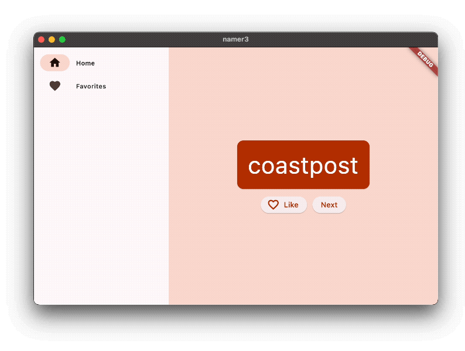

# Learning Flutter: The "Old School" Way

This repository tracks my journey into the **Dart/Flutter** ecosystem. Following a strict "no-AI assistance" rule, I am mastering the fundamentals by diving deep into the official documentation and building everything from scratch.

## Project Overview: Namer App
This is my implementation of the official **Flutter Google Codelab**. The goal is to build a modern, responsive application that generates creative name pairs (like *lightstream* or *graypine*).

  

### Key Features
* **Dynamic Generation:** Creates catchy, random name pairs.
* **Favorites System:** Users can "like" names and save them to a dedicated list.
* **Responsive Design:** A layout that adapts seamlessly to mobile, web, and desktop screens.
* **Navigation:** A sidebar/rail navigation to switch between the Generator and Favorites pages.

---

## Learning Objectives
By completing this first milestone, I am mastering:
* **Flutter Architecture:** Understanding how the Widget tree works.
* **Layout & UI:** Mastering `Column`, `Row`, and `ListView`.
* **State Management:** Connecting user interactions (button presses) to app behavior.
* **Code Organization:** Keeping the Dart codebase clean and maintainable.
* **Responsiveness:** Making the UI look great on any screen size.

---

## Resources Used
* [Official Flutter Documentation](https://docs.flutter.dev/)
* [Dart Language Tour](https://dart.dev/language)
* *Methodology: Manual coding, deep reading, and zero AI-generated snippets.*
